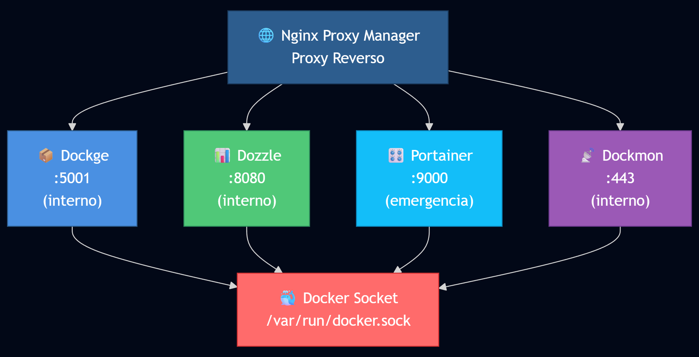

# Docker Admin Stack

Stack de herramientas para administracion y monitoreo de contenedores Docker.

## Componentes

| Servicio | Puerto Host | Funcion |
|----------|-------------|---------|
| **Dockge** | - (via NPM) | Gestor de stacks Docker Compose con UI web |
| **Dozzle** | - (via NPM) | Visor de logs en tiempo real |
| **Portainer** | 9000 | Gestion completa de Docker (acceso emergencia) |
| **Dockmon** | - (via NPM) | Monitor de contenedores con sistema de alertas |

## Arquitectura

> **Nota:** Solo Portainer expone puerto al host (9000) para acceso de emergencia.
> Los demas servicios son accesibles unicamente via Nginx Proxy Manager.

## Requisitos

- Docker y Docker Compose
- Red externa `vpn-proxy` (o modificar NETWORK_NAME en .env)

## Instalacion

1. Clonar el repositorio:
```bash
git clone https://github.com/jborjar/docker_admin.git
cd docker_admin
```

2. Copiar y configurar el archivo de entorno:
```bash
cp .env.example .env
nano .env
```

3. Ejecutar el script de inicializacion:
```bash
chmod +x init.sh
./init.sh
```

4. O iniciar manualmente:
```bash
docker compose up -d
```

## Acceso a Servicios

Los servicios estan expuestos internamente en la red Docker. Para acceso externo, se recomienda usar Nginx Proxy Manager.

| Servicio | URL Interna | Puerto Host |
|----------|-------------|-------------|
| Dockge | http://dockge:5001 | - |
| Dozzle | http://dozzle:8080 | - |
| Portainer | http://portainer:9000 | 9000 (emergencia) |
| Dockmon | https://dockmon:443 | - |

### Acceso de Emergencia

Si NPM no esta disponible, Portainer es accesible directamente via:
```
http://IP_SERVIDOR:9000
```

### Primer Acceso

- **Portainer**: El primer acceso pedira crear un usuario administrador
- **Dockge**: Listo para usar, gestiona stacks en `/opt/stacks`
- **Dozzle**: No requiere configuracion, muestra logs automaticamente
- **Dockmon**: Configurar alertas desde la UI

## Estructura de Archivos

```
docker_admin/
├── docker-compose.yaml    # Definicion de servicios
├── dockerfiles/           # Dockerfiles personalizados
│   └── Dockerfile.dockge  # Dockge con ping/traceroute
├── .env                   # Configuracion (no commitear)
├── .env.example           # Plantilla de configuracion
├── init.sh                # Script de inicializacion
├── README.md              # Este archivo
└── stack_data/            # Datos persistentes
    ├── dockge/
    │   └── data/
    ├── portainer/
    │   └── data/
    └── dockmon/
        └── data/
```

## Imagenes Personalizadas

### jbr_dockge

Imagen basada en `louislam/dockge:latest` con herramientas de red adicionales:
- `ping` (iputils-ping)
- `traceroute`

Las demas imagenes (Dozzle, Portainer, Dockmon) son binarios estaticos sin shell, no permiten agregar paquetes.

## Configuracion

### Variables de Entorno

| Variable | Descripcion | Valor por defecto |
|----------|-------------|-------------------|
| `TZ` | Zona horaria | America/Mexico_City |
| `DATA_PATH` | Ruta de datos persistentes | ./stack_data |
| `NETWORK_NAME` | Red Docker externa | vpn-proxy |
| `DOCKGE_STACKS_DIR` | Directorio de stacks | /opt/stacks |
| `DOZZLE_LEVEL` | Nivel de log de Dozzle | info |

### Directorio de Stacks Compartido

Dockge y DockMon comparten el mismo directorio de stacks (`/opt/stacks`) pero con mapeos diferentes debido a sus rutas internas:

| Servicio | Ruta Host | Ruta Interna | Motivo |
|----------|-----------|--------------|--------|
| **Dockge** | `/opt/stacks` | `/opt/stacks` | Requiere rutas absolutas iguales |
| **DockMon** | `/opt/stacks` | `/app/data/stacks` | Ruta fija interna de la aplicacion |

En `docker-compose.yaml`:
```yaml
# Dockge - rutas iguales (requisito de la aplicacion)
volumes:
  - ${DOCKGE_STACKS_DIR}:${DOCKGE_STACKS_DIR}

# DockMon - mapeo a ruta interna fija
volumes:
  - ${DOCKGE_STACKS_DIR}:/app/data/stacks
```

## Uso con Nginx Proxy Manager

Ejemplo de configuracion de proxy hosts:

```
dockge.tudominio.com    -> http://dockge:5001
dozzle.tudominio.com    -> http://dozzle:8080
portainer.tudominio.com -> http://portainer:9000
dockmon.tudominio.com   -> https://dockmon:443 (SSL)
```

## Comandos Utiles

```bash
# Ver estado de los servicios
docker compose ps

# Ver logs de todos los servicios
docker compose logs -f

# Ver logs de un servicio especifico
docker compose logs -f dockge

# Reiniciar un servicio
docker compose restart portainer

# Actualizar imagenes
docker compose pull
docker compose up -d
```

## Troubleshooting

### Dockge no muestra stacks
- Verificar que `DOCKGE_STACKS_DIR` apunte al directorio correcto
- Las rutas en volumes deben ser absolutas e iguales

### Portainer muestra error de conexion
- Verificar permisos del socket Docker
- El socket debe estar montado como read-only

### Dockmon no responde
- Dockmon usa HTTPS (puerto 443 interno)
- Usar `curl -k` para pruebas (certificado auto-firmado)

## Licencia

MIT License
